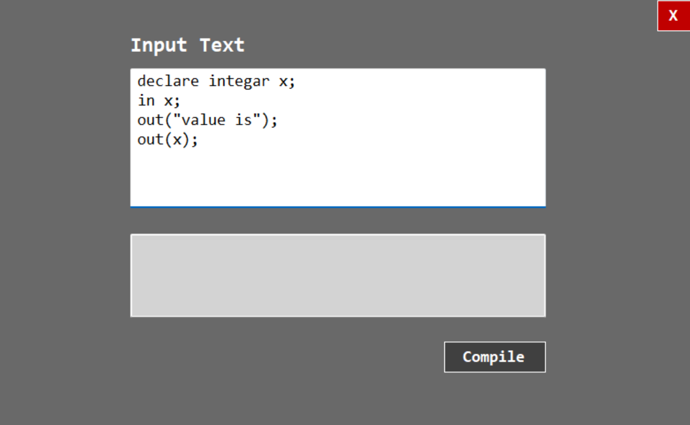
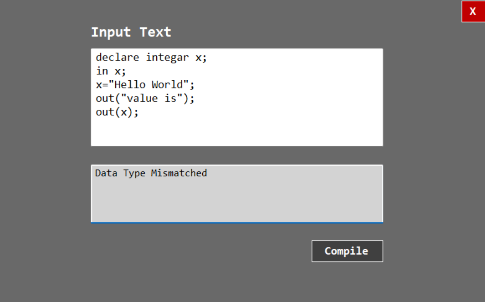

# CustomSharpCompiler

## Overview
CustomSharpCompiler is a semester project built as a Windows Forms application in C#. It compiles a custom programming language with support for variable declarations, operations, functions, and control structures.

## Features

### Variable Declaration and Types
Supports variable declarations for:
- **integar**
- **decimal**
- **match** (boolean)
- **key** (character)

### Arithmetic and Logical Operations
Handles the following operations:
- **Increment**: `inc`
- **Decrement**: `dec`

### Functions
Supports function declarations and function calls.

### Classes
Allows defining classes using custom syntax.

### Input/Output
Supports basic input and output operations.

### Conditional Statements
Supports `if-else` conditions with custom syntax:
- **If**: `agar`
- **Else**: `magar`
- **Else If**: `agarmagar`

### Loops
Supports `for` loops with custom syntax.

## Technology Stack
- **Language**: C#
- **Framework**: Windows Forms
- **Tools**: Visual Studio

## Installation and Setup

1. Clone the repository:
    ```bash
    git clone https://github.com/usamafayaz/CustomSharpCompiler.git
    ```

2. Open the project in Visual Studio.

3. Build the solution:
    ```bash
    Build > Build Solution
    ```

4. Run the application:
    ```bash
    Debug > Start Without Debugging
    ```

## Contact
For any inquiries, please contact [usama.fayyaz157@gmail.com].




